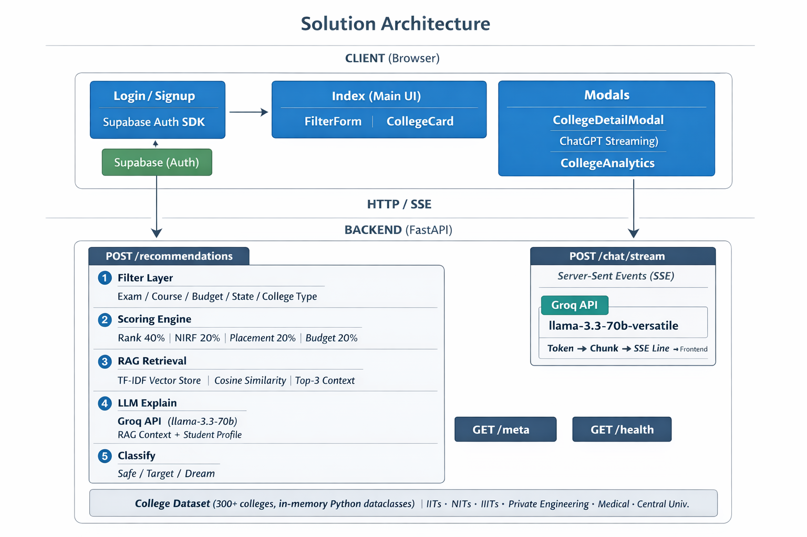
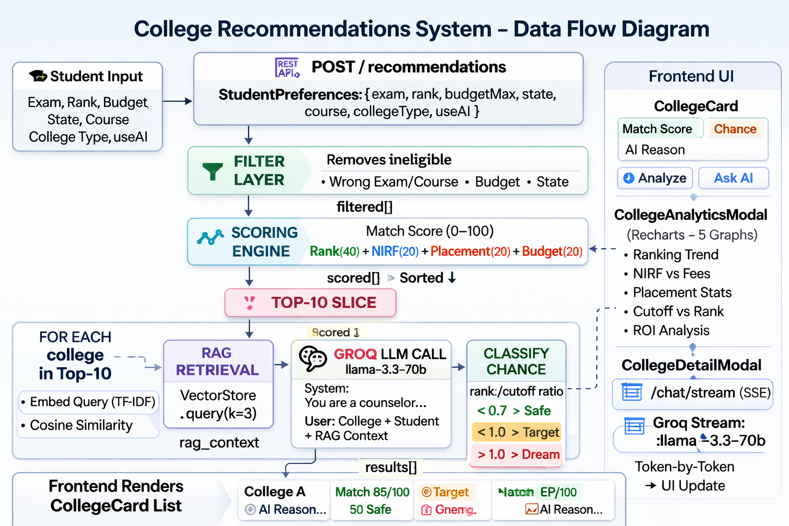

<div align="center">


# College Admission Assistance Agent

### AI-powered college recommendation system with RAG, streaming LLM chat, analytics dashboards, and Supabase authentication

[](https://react.dev)
[](https://fastapi.tiangolo.com)
[](https://groq.com)
[](https://supabase.com)
[](https://typescriptlang.org)
[](https://tailwindcss.com)

</div>

---

## Table of Contents

1. [Project Overview](#-project-overview)
2. [Live Features](#-live-features)
3. [Solution Architecture](#-solution-architecture)
4. [Tech Stack](#-tech-stack)
5. [Project Structure](#-project-structure)
6. [Complete Workflow](#-complete-workflow)
7. [API Reference](#-api-reference)
8. [Setup & Installation](#-setup--installation)
9. [Environment Variables](#-environment-variables)
10. [RAG Pipeline Deep Dive](#-rag-pipeline-deep-dive)
11. [Scoring Algorithm](#-scoring-algorithm)
12. [Frontend Components](#-frontend-components)
13. [Database & Auth](#-database--auth)
14. [Deployment](#-deployment)
15. [Future Roadmap](#-future-roadmap)

---

## 🎓 Project Overview

Every year, millions of Indian students face a critical challenge: **they don't know which colleges they're eligible for**, can't easily classify Safe / Target / Dream colleges, and have no personalized guidance system. Data is scattered across hundreds of websites.

**College Admission Assistance Agent** solves this with:

- **AI-powered recommendations** personalized to each student's rank, budget, state, and course
- **RAG (Retrieval-Augmented Generation)** for context-aware, explainable results
- **ChatGPT-style streaming chat** to deep-dive any college with an AI advisor
- **Interactive analytics dashboards** with 5 chart types (Radar, Radial, Bar, Trend, Budget)
- **Supabase authentication** with email/password and Google OAuth
- **300+ college dataset** covering IITs, NITs, IIITs, private colleges, medical colleges, and central universities

---

## ✨ Live Features

| Feature | Description |
|---|---|
| 🔐 **Auth** | Login / Signup with email + Google OAuth via Supabase |
| 🎯 **Smart Filtering** | Filter by exam (JEE/NEET/CUET), rank, budget, state, course, college type |
| 🤖 **AI Explanations** | Groq LLM generates personalized 2–3 sentence explanations per college |
| 🟢🟡🟣 **Chance Classifier** | Safe / Target / Dream classification based on rank-to-cutoff ratio |
| 📊 **Analytics Modal** | 5-tab statistics dashboard — Overview Radar, Score Gauge, Comparison Bars, Rank Trend, Budget Fit |
| 💬 **AI Chat Advisor** | Click any college → ChatGPT-style streaming conversation about that college |
| ⚡ **RAG Pipeline** | TF-IDF vector store retrieves contextually similar colleges to enrich LLM prompts |
| 📱 **Responsive UI** | Mobile-first design with bottom sheets on mobile, modals on desktop |

---

## 🏗 Solution Architecture


### Data Flow Diagram

### Authentication Flow

```
User visits / ──► AuthContext checks Supabase session
                      │
              ┌───────┴──────────┐
              │ No session        │ Has session
              ▼                  ▼
        Redirect /login    Render Index page
              │
        Login / Signup
              │
        Supabase Auth
        (email or Google OAuth)
              │
        Session stored in
        localStorage by Supabase
              │
        Redirect /
```

---

## 🛠 Tech Stack

### Frontend

| Technology | Version | Purpose |
|---|---|---|
| React | 18.3 | UI framework |
| TypeScript | 5.8 | Type safety |
| Vite | 5.4 | Build tool & dev server |
| Tailwind CSS | 3.4 | Utility-first styling |
| shadcn/ui | latest | Accessible UI components (Radix primitives) |
| Recharts | 2.15 | Interactive charts (Radar, Bar, Area, Radial) |
| React Router DOM | 6.30 | Client-side routing |
| @supabase/supabase-js | 2.x | Auth & session management |
| Lucide React | 0.462 | Icon library |
| TanStack Query | 5.83 | Server state management |

### Backend

| Technology | Version | Purpose |
|---|---|---|
| Python | 3.11+ | Runtime |
| FastAPI | 0.111 | REST API framework |
| Uvicorn | 0.29 | ASGI server |
| Groq SDK | 0.9+ | LLM inference (llama-3.3-70b-versatile) |
| NumPy | 1.26+ | TF-IDF vector math |
| Pydantic | 2.x | Request/response validation |
| python-dotenv | 1.0 | Environment variable loading |

### Infrastructure & Services

| Service | Purpose |
|---|---|
| Supabase | Authentication (email + Google OAuth) |
| Groq Cloud | LLM inference — ultra-fast llama-3.3-70b |
| Vite Dev Server | Frontend HMR on port 5173 |
| Uvicorn | Backend API on port 8000 |

---

## 📁 Project Structure

```
college-admission-agent/
│
├── backend/                          # FastAPI backend
│   ├── main.py                       # Main app — all routes, data, RAG, scoring
│   ├── requirements.txt              # Python dependencies
│   ├── .env.example                  # Environment variable template
│   └── README.md                     # Backend-specific docs
│
└── frontend/                         # React + Vite frontend
    ├── public/
    │   └── logo.png                  # Project logo
    ├── src/
    │   ├── App.tsx                   # Router + auth provider setup
    │   ├── main.tsx                  # React entry point
    │   ├── index.css                 # Global styles + CSS variables
    │   │
    │   ├── context/
    │   │   └── AuthContext.tsx       # Supabase session state + useAuth hook
    │   │
    │   ├── lib/
    │   │   ├── supabase.ts           # Supabase client singleton
    │   │   ├── recommendation.ts     # API calls to backend + TypeScript types
    │   │   └── utils.ts              # Tailwind class merger (cn)
    │   │
    │   ├── pages/
    │   │   ├── Index.tsx             # Main page: search form + results + modals
    │   │   ├── Login.tsx             # Login with animated left panel + Supabase
    │   │   ├── Signup.tsx            # Signup with animated left panel + Supabase
    │   │   └── NotFound.tsx          # 404 page
    │   │
    │   ├── components/
    │   │   ├── FilterForm.tsx        # Student preferences input form
    │   │   ├── CollegeCard.tsx       # Result card with Analyze + Ask AI buttons
    │   │   ├── CollegeDetailModal.tsx    # ChatGPT-style streaming AI chat
    │   │   ├── CollegeAnalyticsModal.tsx # 5-tab statistics dashboard
    │   │   └── ui/                   # shadcn/ui primitives (40+ components)
    │   │
    │   ├── data/
    │   │   └── colleges.ts           # 300+ college dataset + constants
    │   │
    │   └── hooks/
    │       ├── use-toast.ts
    │       └── use-mobile.tsx
    │
    ├── package.json
    ├── tailwind.config.ts
    ├── tsconfig.app.json
    └── vite.config.ts
```

---

## 🔄 Complete Workflow

### Step 1 — Student Input
The `FilterForm` captures:
- **Exam type** — JEE / NEET / CUET
- **Rank** — numeric rank in the exam
- **Max Budget** — slider from ₹10K to ₹20L per year
- **Preferred State** — any of 28+ Indian states or "Any"
- **Course** — BTech / MBBS / BA / BSc / BCom
- **College Type** — Government / Private / Any

### Step 2 — Filter Layer (Backend)
Rule-based pre-filtering removes colleges where:
- Exam type doesn't match
- Course doesn't match
- Fees exceed the student's budget
- State preference doesn't match (if specified)
- Student rank exceeds `closing_rank + 30%` margin (dream colleges still included)

Reduces 300+ colleges to a relevant shortlist.

### Step 3 — Scoring Engine
Each filtered college receives a **match score (0–100)**:

```
matchScore = (
  rankProximity  × 0.40   +   # How close is rank to closing rank
  nirfScore      × 0.20   +   # Normalized NIRF ranking (1 = best)
  placementScore × 0.20   +   # Placement rate / 100
  budgetFit      × 0.20       # 1 - (fees / maxBudget)
) × 100
```

Colleges are sorted descending by `matchScore`, top 10 returned.

### Step 4 — RAG (Retrieval-Augmented Generation)
For each of the top-10 colleges:

1. **Build query**: Student profile text + college name
2. **TF-IDF embed**: Query vectorized using pre-built vocabulary + IDF weights
3. **Cosine similarity**: Top-3 most similar colleges retrieved from vector store
4. **Context assembly**: Structured text with retrieved colleges' stats
5. **LLM call**: Groq `llama-3.3-70b-versatile` with student profile + college data + RAG context → personalized 2–3 sentence explanation

### Step 5 — Classification
```
ratio = studentRank / closingRank

ratio ≤ 0.70  →  🟢 Safe   (high probability)
ratio ≤ 1.00  →  🟡 Target (competitive, achievable)
ratio  > 1.00  →  🟣 Dream  (aspirational, monitor cutoffs)
```

### Step 6 — Frontend Rendering
Results display as `CollegeCard` components with:
- Match score badge
- Safe/Target/Dream pill
- Stats strip (Closing Rank, Fees, NIRF, Placement)
- AI-generated explanation
- **"Analyze Statistics"** → opens 5-tab analytics modal
- **"Ask AI"** → opens streaming chat modal

---


## ⚙️ Setup & Installation

### Prerequisites

- **Node.js** ≥ 18 or **Bun** ≥ 1.0
- **Python** ≥ 3.11
- **Supabase account** (free) → [supabase.com](https://supabase.com)
- **Groq API key** (free) → [console.groq.com](https://console.groq.com)

---

### 1. Clone the Repository

```bash
git clone https://github.com/your-org/college-admission-agent.git
cd college-admission-agent
```

---

### 2. Backend Setup

```bash
cd backend

# Create virtual environment (recommended)
python -m venv venv
source venv/bin/activate        # Windows: venv\Scripts\activate

# Install dependencies
pip install -r requirements.txt

# Configure environment
cp .env.example .env
# Edit .env and set GROQ_API_KEY=gsk_...

# Start the server
uvicorn main:app --reload --port 8000
```

Backend runs at: **http://localhost:8000**
API docs (Swagger): **http://localhost:8000/docs**

---

### 3. Frontend Setup

```bash
cd frontend

# Install dependencies
bun install           # or: npm install

# Add Supabase client (if not already installed)
bun add @supabase/supabase-js

# Configure environment
cp .env.example .env
# Edit .env with your values (see Environment Variables section)

# Start dev server
bun run dev           # or: npm run dev
```

Frontend runs at: **http://localhost:5173**

---

### 4. Supabase Setup

1. Go to [supabase.com](https://supabase.com) → **New Project**
2. Navigate to **Settings → API** → copy:
   - **Project URL** → `VITE_SUPABASE_URL`
   - **anon public key** → `VITE_SUPABASE_ANON_KEY`
3. Enable **Authentication → Providers → Email** (default on)
4. Optionally enable **Google OAuth**:
   - Create a Google OAuth app in [Google Cloud Console](https://console.cloud.google.com)
   - Add `http://localhost:5173` as authorized redirect URI
   - Add credentials to Supabase → Auth → Providers → Google
5. Under **Auth → URL Configuration**, add `http://localhost:5173` as redirect URL

---

## 🔑 Environment Variables

### Backend (`backend/.env`)

```env
# Groq API Key — get from https://console.groq.com
GROQ_API_KEY=gsk_your_key_here
```

### Frontend (`frontend/.env`)

```env
# FastAPI backend URL
VITE_API_URL=http://localhost:8000

# Supabase — from your project Settings → API
VITE_SUPABASE_URL=https://xxxxxxxxxxxx.supabase.co
VITE_SUPABASE_ANON_KEY=eyJhbGciOiJIUzI1NiIsInR5cCI6IkpXVCJ9...
```

---


## 🔐 Database & Auth

Authentication is handled entirely by **Supabase** — no custom user table required.

### Auth Flow

```
SignUp:
  supabase.auth.signUp({ email, password, options: { data: { full_name } } })
  → Supabase sends confirmation email
  → User clicks link → session created

Login:
  supabase.auth.signInWithPassword({ email, password })
  → Returns session with access_token + refresh_token
  → Stored in localStorage by Supabase client

Google OAuth:
  supabase.auth.signInWithOAuth({ provider: "google" })
  → Redirects to Google consent screen
  → Redirects back to app with session

Session persistence:
  supabase.auth.onAuthStateChange(callback)
  → AuthContext subscribes → updates React state on every change
```

## 📄 License

MIT License — see [LICENSE](LICENSE) for details.

---

<div align="center">

Built with ❤️ for Indian students navigating college admissions

**[Report Bug](https://github.com/your-org/college-admission-agent/issues)** · **[Request Feature](https://github.com/your-org/college-admission-agent/issues)**

</div>